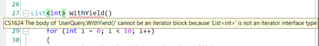

To me, `yield return` has always been one of the most difficult things to understand.

Now that I've understood it (not thoroughly, but enough to explain it), it's my turn to share my learnings.

So, what does `yield return` mean? How is it related to collections of items?

## Using Lists

Say that you're returning a collection of items and that you need to iterate over them. 

A first approach could be creating a list with all the items, returning it to the caller, and iterating over the collection:

```cs
IEnumerable<int> WithList()
{
    List<int> items = new List<int>();

    for (int i = 0; i < 10; i++)
    {
        Console.WriteLine($"Added item {i}");
        items.Add(i);
    }

    return items;
}

void Main()
{
    var items = WithList();

    foreach (var i in items)
    {
        Console.WriteLine($"This is Mambo number {i}");
    }
}
```

This snippet creates the whole collection and then prints the values inside that list. On the console, you'll see this text: 

```txt
Added item 0
Added item 1
Added item 2
Added item 3
Added item 4
Added item 5
Added item 6
Added item 7
Added item 8
Added item 9
This is Mambo number 0
This is Mambo number 1
This is Mambo number 2
This is Mambo number 3
This is Mambo number 4
This is Mambo number 5
This is Mambo number 6
This is Mambo number 7
This is Mambo number 8
This is Mambo number 9
```

This means that, if you need to operate over a collection with 1 million items, at first you'll create ALL the items, and then you'll perform operations on each of them. This approach has two main disadvantages: it's slow (especially if you only need to work with a subset of those items), and occupies a lot of memory.

## With Yield

We can use another approach: use the `yield return` keywords:

```cs
IEnumerable<int> WithYield()
{
    for (int i = 0; i < 10; i++)
    {
        Console.WriteLine($"Returning item {i}");

        yield return i;
    }
}

void Main()
{
    var items = WithYield();

    foreach (var i in items)
    {
        Console.WriteLine($"This is Mambo number {i}");
    }
}
```

With this method, the order of messages is different:

```txt
Returning item 0
This is Mambo number 0
Returning item 1
This is Mambo number 1
Returning item 2
This is Mambo number 2
Returning item 3
This is Mambo number 3
Returning item 4
This is Mambo number 4
Returning item 5
This is Mambo number 5
Returning item 6
This is Mambo number 6
Returning item 7
This is Mambo number 7
Returning item 8
This is Mambo number 8
Returning item 9
This is Mambo number 9
```

So, instead of creating the whole list, we create one item at a time, and only when needed.

## Benefits of Yield

As I said before, there are several benefits with `yield`: the application is more performant when talking about both the execution time and the memory usage.

It's like an automatic iterator: every time you get a result, the iterator advances to the next item.

Just a note: `yield` works only for methods that return `IAsyncEnumerable<T>`, `IEnumerable<T>`, `IEnumerable`, `IEnumerator<T>`, or `IEnumerator`.

You cannot use it with a method that returns, for instance, `List<T>`, because, as the error message says, 

> The body of X cannot be an iterator block because `List<int>` is not an iterator interface type




## A real use case

If you use **NUnit** as a test suite, you've probably already used this keyword. 

In particular, when using the `TestCaseSource` attribute, you specify the name of the class that outputs the test cases.

```cs
public class MyTestClass
{
    [TestCaseSource(typeof(DivideCases))]
    public void DivideTest(int n, int d, int q)
    {
        Assert.AreEqual(q, n / d);
    }
}

class DivideCases : IEnumerable
{
    public IEnumerator GetEnumerator()
    {
        yield return new object[] { 12, 3, 4 };
        yield return new object[] { 12, 2, 6 };
        yield return new object[] { 12, 4, 3 };
    }
}
```

When executing the tests, an iterator returns a test case at a time, without creating a full list of test cases.

The previous snippet is taken directly from NUnit's documentation for the `TestCaseSource` attribute, [that you can find here](https://docs.nunit.org/articles/nunit/writing-tests/attributes/testcasesource.html "TestCaseSource documentation on NUnit").

## Wrapping up

Yes, `yield` is a quite difficult keyword to understand.

To read more, head to [the official docs](https://docs.microsoft.com/en-us/dotnet/csharp/language-reference/keywords/yield "Yield documentation on Microsoft docs").

Another good resource is ["C# – Use yield return to minimize memory usage"](https://makolyte.com/csharp-use-yield-return-to-minimize-memory-usage/ "Another article about yield return by Makolyte") by [Makolyte](https://twitter.com/makolyte). You should definitely check it out!

And, if you want, check out the conversation I had about this keyword [on Twitter](https://twitter.com/BelloneDavide/status/1455973842762010630 "Twitter conversation about yield return").

Happy coding!

🐧