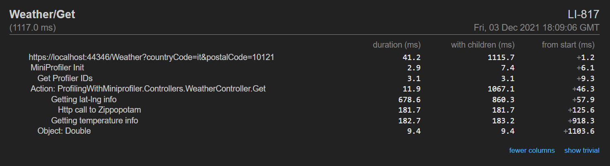

Do you need to tune up the performance of your code? You can create some StopWatch objects and store the execution times or rely on external libraries like **MiniProfiler**.

> Note: of course, we're just talking about time duration, and not about memory usage!

## How to profile code using Stopwatch

A `Stopwatch` object acts as a (guess what?) stopwatch.

You can manually make it start and stop, and keep track of the elapsed time:

```cs
Stopwatch sw = Stopwatch.StartNew();
DoSomeOperations(100);
var with100 = sw.ElapsedMilliseconds;


sw.Restart();
DoSomeOperations(2000);
var with2000 = sw.ElapsedMilliseconds;

sw.Stop();

Console.WriteLine($"With 100: {with100}ms");
Console.WriteLine($"With 2000: {with2000}ms");
```

It's useful, but you have to do it manually. There's a better choice.

## How to profile code using MiniProfiler

A good alternative is **MiniProfiler**: you can create a `MiniProfiler` object that holds all the info related to the current code execution. You then can add some `Step`s, which can have a name, and even nest them.

Finally, you can print the result using `RenderPlainText`.

```cs
MiniProfiler profiler = MiniProfiler.StartNew();

using (profiler.Step("With 100"))
{
    DoSomeOperations(100);
}


using (profiler.Step("With 2000"))
{
    DoSomeOperations(2000);
}

Console.WriteLine(profiler.RenderPlainText());
```

You won't anymore stop and start any `StopWatch` instance.

You can even use inline steps, to profile method execution and store its return value:

```cs
var value = profiler.Inline(() => MethodThatReturnsSomething(12), "Get something");
```

Here I decided to print the result on the Console. You can even create HTML reports, which are quite useful when profiling websites. You can [read more here](https://www.code4it.dev/blog/miniprofiler), where I experimented with MiniProfiler in a .NET API project.

Here's an example of what you can get:



## Further readings

We've actually already talked about MiniProfiler in an in-depth article you can find here:

🔗 [Profiling .NET code with MiniProfiler | Code4IT](https://www.code4it.dev/blog/miniprofiler)

Which, oddly, is almost more detailed than the official documentation, that you can still find here:

🔗 [MiniProfiler for .NET | MiniProfiler](https://miniprofiler.com/dotnet/ConsoleDotNetCore)

Happy coding!

🐧
